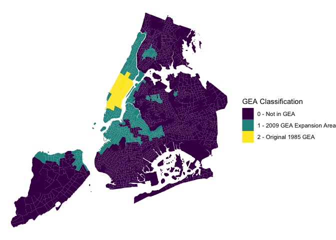
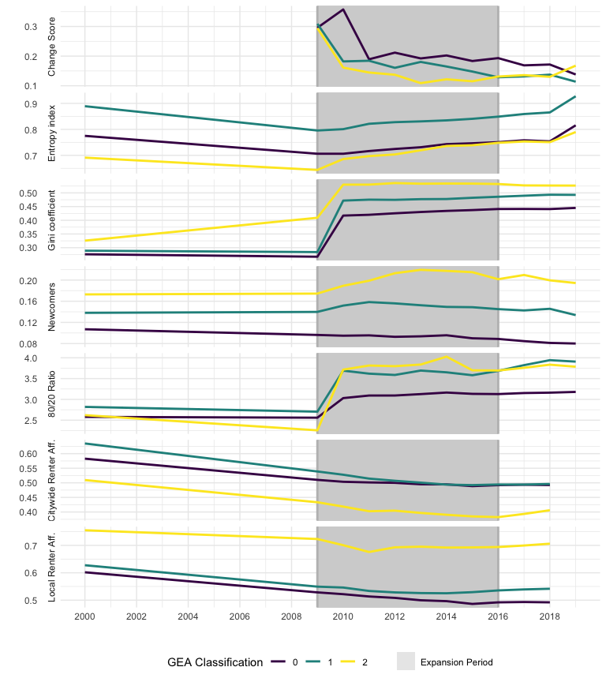
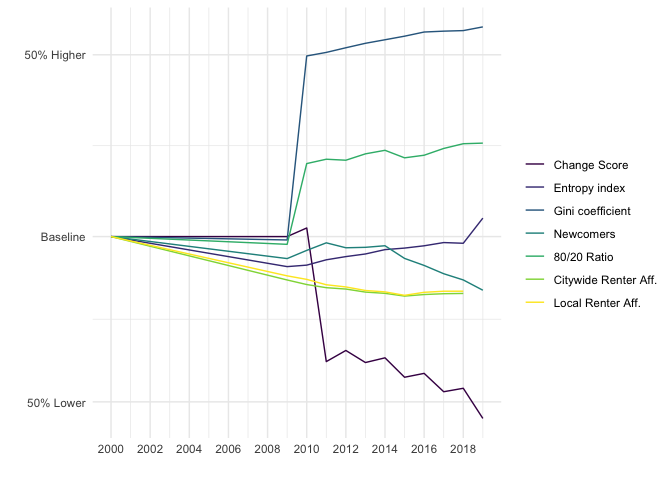
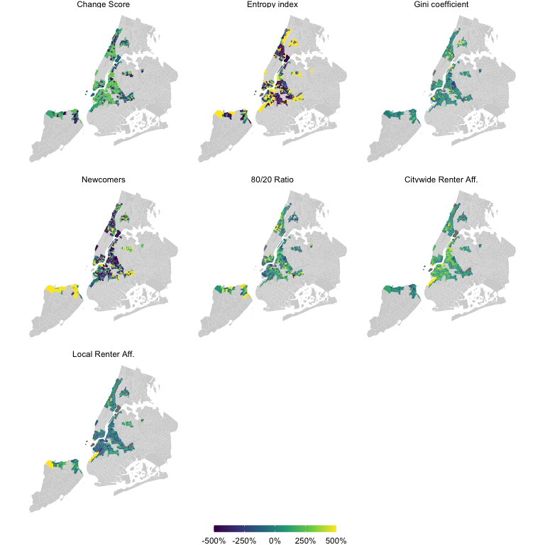
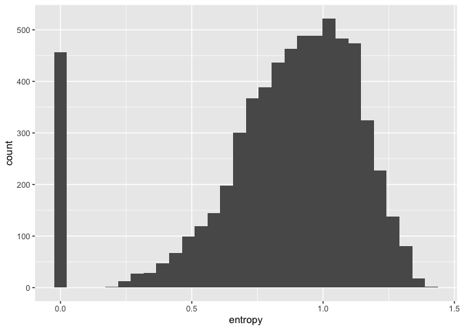
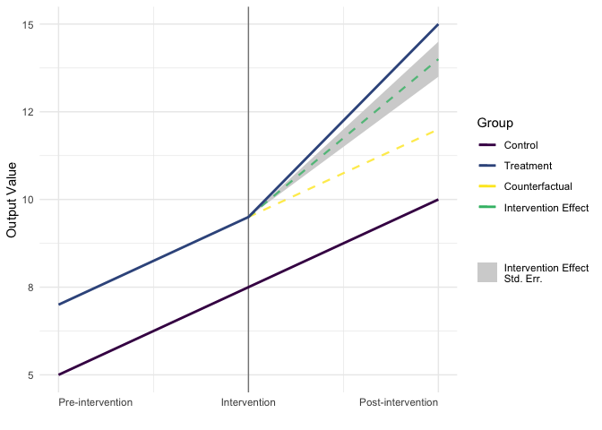
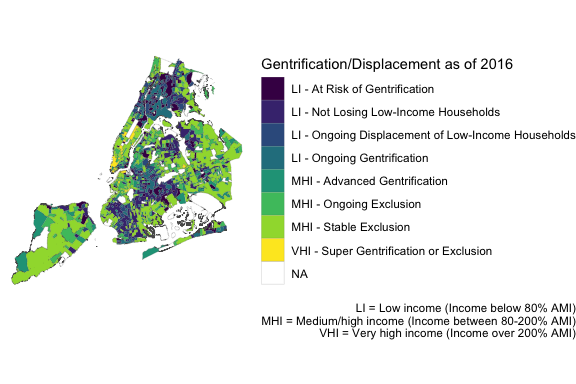

Thesis Figures
================
Erik Strand
2022-05-04

``` r
knitr::opts_chunk$set(cache = TRUE)
```

``` r
library(tidyverse)
```

    ## ── Attaching packages ─────────────────────────────────────── tidyverse 1.3.1 ──

    ## ✓ ggplot2 3.3.5     ✓ purrr   0.3.4
    ## ✓ tibble  3.1.6     ✓ dplyr   1.0.7
    ## ✓ tidyr   1.1.4     ✓ stringr 1.4.0
    ## ✓ readr   2.0.2     ✓ forcats 0.5.1

    ## ── Conflicts ────────────────────────────────────────── tidyverse_conflicts() ──
    ## x dplyr::filter() masks stats::filter()
    ## x dplyr::lag()    masks stats::lag()

``` r
library(sf)
```

    ## Linking to GEOS 3.8.1, GDAL 3.2.1, PROJ 7.2.1

``` r
master <- 
    sf::read_sf("../data_clean/master_database.shp")

master2 <- 
    master %>%  
    mutate_at(vars(gini, newcomers, ratio_8020, chng_score), ~ . * -1) 
    
quantiles_entropy <- 
    quantile(master2$entropy, probs = seq(0, 1, 0.2), na.rm = T)

quantiles_newcomers <- 
    quantile(master2$newcomers, probs = seq(0, 1, 0.2), na.rm = T)

quantiles_gini <- 
    quantile(master2$gini, probs = seq(0, 1, 0.2), na.rm = T)

quantiles_rntafflcl <- 
    quantile(master2$rntafflcl, probs = seq(0, 1, 0.2), na.rm = T)

quantiles_rntaffcty <- 
    quantile(master2$rntaffcty, probs = seq(0, 1, 0.2), na.rm = T)

quantiles_ratio_8020 <- 
    quantile(master2$ratio_8020, probs = seq(0, 1, 0.2), na.rm = T)

quantiles_chng_score <- 
    quantile(master2$chng_score, probs = seq(0, 1, 0.2), na.rm = T)

master2 <- 
    master2 %>% 
    mutate(
        time = ifelse(period == "Pre", 0, 1), 
        treatment = gea, 
        time_c = year - 2009,
        did = time * treatment,
        entropy_reclass = 
            case_when(
                entropy < quantiles_entropy[2] ~ "Lowest", 
                entropy < quantiles_entropy[3] ~ "Low", 
                entropy < quantiles_entropy[4] ~ "Middle", 
                entropy < quantiles_entropy[5] ~ "High", 
                TRUE ~ "Highest"
            ), 
        entropy_fact = as.factor(entropy_reclass), 
        newcomers_reclass = 
            case_when(
                newcomers < quantiles_newcomers[2] ~ "Lowest", 
                newcomers < quantiles_newcomers[3] ~ "Low", 
                newcomers < quantiles_newcomers[4] ~ "Middle", 
                newcomers < quantiles_newcomers[5] ~ "High", 
                TRUE ~ "Highest"
            ), 
        newcomers_fact = as.factor(newcomers_reclass),
        gini_reclass = 
            case_when(
                gini < quantiles_gini[2] ~ "Lowest", 
                gini < quantiles_gini[3] ~ "Low", 
                gini < quantiles_gini[4] ~ "Middle", 
                gini < quantiles_gini[5] ~ "High", 
                TRUE ~ "Highest"
            ), 
        gini_fact = as.factor(gini_reclass), 
        rntafflcl_reclass = 
            case_when(
                rntafflcl < quantiles_rntafflcl[2] ~ "Lowest", 
                rntafflcl < quantiles_rntafflcl[3] ~ "Low", 
                rntafflcl < quantiles_rntafflcl[4] ~ "Middle", 
                rntafflcl < quantiles_rntafflcl[5] ~ "High", 
                TRUE ~ "Highest"
            ), 
        rntafflcl_fact = as.factor(rntafflcl_reclass),  
        rntaffcty_reclass = 
            case_when(
                rntaffcty < quantiles_rntaffcty[2] ~ "Lowest", 
                rntaffcty < quantiles_rntaffcty[3] ~ "Low", 
                rntaffcty < quantiles_rntaffcty[4] ~ "Middle", 
                rntaffcty < quantiles_rntaffcty[5] ~ "High", 
                TRUE ~ "Highest"
            ), 
        rntaffcty_fact = as.factor(rntaffcty_reclass), 
        ratio_8020_reclass = 
            case_when(
                ratio_8020 < quantiles_ratio_8020[2] ~ "Lowest", 
                ratio_8020 < quantiles_ratio_8020[3] ~ "Low", 
                ratio_8020 < quantiles_ratio_8020[4] ~ "Middle", 
                ratio_8020 < quantiles_ratio_8020[5] ~ "High", 
                TRUE ~ "Highest"
            ), 
        ratio_8020_fact = as.factor(ratio_8020_reclass), 
        chng_score_reclass = 
            case_when(
                chng_score < quantiles_chng_score[2] ~ "Lowest", 
                chng_score < quantiles_chng_score[3] ~ "Low", 
                chng_score < quantiles_chng_score[4] ~ "Middle", 
                chng_score < quantiles_chng_score[5] ~ "High", 
                TRUE ~ "Highest"
            ), 
        chng_score_fact = as.factor(chng_score_reclass), 
    )

outputs <- 
    c(
        "gini", 
        "ratio_8020", 
        "chng_score",
        "entropy",
        "rntafflcl", 
        "rntaffcty", 
        "newcomers"
    )

outputs_fact <- 
    c(
        "gini_fact", 
        "ratio_8020_fact", 
        "chng_score_fact",
        "entropy_fact",
        "rntafflcl_fact", 
        "rntaffcty_fact", 
        "newcomers_fact"
    )
```

``` r
master %>% 
    filter(year == 2010) %>% 
    ggplot() + 
    geom_sf(aes(fill = as.factor(gea)), size = 0) + 
    scale_fill_viridis_d(
      breaks = c(0, 1, 2), 
      labels = 
        c(
          "0 - Not in GEA", 
          "1 - 2009 GEA Expansion Area", 
          "2 - Original 1985 GEA"
        )
    ) + 
    theme_void() + 
    theme(plot.title = element_text(hjust = 0.5)) + 
    labs(
       # title = "421a GEA Expansion: CT2010 Boundary Approximation",
        fill = "GEA Classification"
    )
```

<!-- -->

``` r
var_labs <- 
    c(
        "Change Score", "Entropy index", "Gini coefficient", "Newcomers", 
        "80/20 Ratio", "Local Renter Aff.", "Citywide Renter Aff."
    )

names(var_labs) = 
    c(
        "chng_score_fact", "entropy_fact", "gini_fact", "newcomers_fact", 
        "ratio_8020_fact", "rntafflcl_fact", "rntaffcty_fact"
    )

# master2 %>% 
#     select(year, all_of(outputs_fact)) %>% 
#     gather(
#         key = "variable", 
#         value = "quantile", 
#         -c(year, geometry)
#     ) %>% 
#     filter(
#         !(year == 2000 & str_detect(variable, "chng")),
#         !(year == 2019 & str_detect(variable, "rntaff"))
#     ) %>%
#     mutate(
#         quantile = as_factor(quantile),
#         quantile = 
#             fct_relevel(
#                 quantile, 
#                 c("Lowest", "Low", "Middle", "High", "Highest")
#             )
#     ) %>% 
#     filter(year %in% c(2000,2009,2015,2019)) %>% 
#     ggplot() + 
#     geom_sf(aes(fill = quantile), size = 0) + 
#     facet_grid(
#         rows = vars(variable), cols = vars(year), 
#         labeller = labeller(variable = var_labs)
#     ) + 
#     scale_fill_brewer(
#         palette = "RdYlGn", 
#         labels = c("Least Desirable", "", "", "", "Most Desirable")
#     ) + 
#     theme_void() +
#     theme(legend.position = "bottom") + 
#     labs(
#         fill = ""
#     )
```

``` r
outputs_avgs <- 
    master %>% 
    st_drop_geometry() %>% 
    select(gea, period, year, total_pop, all_of(outputs)) %>% 
    group_by(year, gea, period) %>% 
    summarise_all(~ mean(., na.rm = TRUE, wt = total_pop))

outputs_avgs_all <- 
    master %>% 
    st_drop_geometry() %>% 
    select(year, all_of(outputs)) %>% 
    group_by(year) %>% 
    summarise_all(~ mean(., na.rm = TRUE, wt = total_pop))
```

``` r
var_labs_raw <- 
    c(
        "Change Score", "Entropy index", "Gini coefficient", "Newcomers", 
        "80/20 Ratio", "Local Renter Aff.", "Citywide Renter Aff."
    )

names(var_labs_raw) = 
    c(
        "chng_score", "entropy", "gini", "newcomers", 
        "ratio_8020", "rntafflcl", "rntaffcty"
    )

outputs_avgs %>% 
    select(-total_pop) %>% 
    pivot_longer(
        -c(year, gea, period), 
        names_to = "variable", 
        values_to = "estimate"
    ) %>% 
    ggplot() + 
    geom_rect(
        aes(xmin = 2009, xmax = 2016, ymin = -Inf, ymax = Inf, fill = "Expansion Period"), 
        alpha = 0.5, 
        size = 0
    ) + 
    geom_vline(aes(xintercept = 2009), color = "grey", size = 1) +
    geom_vline(aes(xintercept = 2016), color = "grey", size = 1) +
    geom_line(
        aes(x = year, y = estimate, color = as.factor(gea), group = gea), 
        size = 1
    ) + 
    facet_grid(
        rows = vars(variable), 
        scales = "free", 
        switch = "y", 
        labeller = labeller(variable = var_labs_raw)
    ) + 
    scale_x_continuous(breaks = scales::breaks_width(2)) + 
    scale_color_viridis_d() + 
    scale_fill_manual(name = "", values = c(`Expansion Period` = "lightgrey")) +
    labs(
        x = "",
        y = "",
        color = "GEA Classification", 
        fill = ""
    ) + 
    theme_minimal() + 
    theme(legend.position = "bottom")
```

    ## Warning: Removed 6 row(s) containing missing values (geom_path).

<!-- -->

``` r
var_labs_order <- 
    c(
        "Gini coefficient", "80/20 Ratio", "Change Score", "Entropy index",  
        "Local Renter Aff.", "Citywide Renter Aff.", "Newcomers" 
    )

outputs_avgs_all %>% 
    #mutate_at(vars(gini:newcomers), scales::rescale, c(0, 1)) %>% 
    arrange(year) %>% 
    mutate(chng_score = ifelse(year == 2000, lead(chng_score), chng_score)) %>% 
    mutate_at(vars(gini:newcomers), ~ . / first(.) - 1) %>% 
    #mutate_at(vars(gini, ratio_8020, chng_score, newcomers), ~ . * -1) %>%
    pivot_longer(
        -c(year), 
        names_to = "variable", 
        values_to = "estimate"
    ) %>% 
    ggplot() + 
    geom_line(aes(x = year, y = estimate, color = variable)) + 
    scale_color_viridis_d(labels = var_labs_raw) + 
    scale_x_continuous(breaks = scales::breaks_width(2)) + 
    scale_y_continuous(
      breaks = c(-0.5, 0, 0.55), 
      labels = c("50% Lower", "Baseline", "50% Higher")
    ) + 
    theme_minimal() + 
    labs(
      x = "", 
      y = "", 
      color = ""
    )
```

    ## Warning: Removed 2 row(s) containing missing values (geom_path).

<!-- -->

``` r
outputs_slope <- 
  outputs_avgs %>% 
  group_by(gea, period) %>% 
  summarize_at(vars(all_of(outputs)), mean, na.rm = TRUE) %>% 
  ungroup() %>% 
  filter(period != "Post2") %>% 
  pivot_longer(
    -c(gea, period), 
    names_to = "variable", 
    values_to = "estimate"
  ) %>% 
  pivot_wider(
    names_from = period, 
    values_from = estimate
  ) %>% 
  mutate(
    delta = Post1 - Pre, 
    perc_delta_exp = delta / Pre
  ) %>% 
  filter(gea == 0) %>% 
  select(variable, perc_delta_exp)

residuals <- 
  master %>% 
  st_drop_geometry() %>% 
  group_by(geoid2010, gea, year, period) %>% 
  summarize_at(all_of(outputs), ~ mean(., na.rm = TRUE, wt = total_pop)) %>% 
  filter(period != "Post2") %>% 
  pivot_longer(
    -c(geoid2010, gea, year, period),
    names_to = "variable", 
    values_to = "estimate"
  ) %>% 
  drop_na(estimate) %>% 
  pivot_wider(
    names_from = period, 
    values_from = estimate
  ) %>% 
  group_by(geoid2010, gea, variable) %>% 
  arrange(year) %>% 
  filter(gea == 1) %>% 
  summarize(
    Pre = first(Pre), 
    Post1 = last(Post1), 
    delta_act = Post1 - Pre, 
    perc_delta_act = delta_act / Pre
  ) %>% 
  left_join(outputs_slope, by = "variable") %>% 
  mutate(
    delta_exp = Pre * perc_delta_exp, 
    residual = delta_act - delta_exp, 
    perc_residual = (residual / delta_exp),
    perc_residual = ifelse(perc_residual < -5, -5, perc_residual), 
    perc_residual = ifelse(perc_residual > 5, 5, perc_residual)
  )
```

    ## `summarise()` has grouped output by 'geoid2010', 'gea'. You can override using
    ## the `.groups` argument.

``` r
var_labs_raw <- 
    c(
        "Change Score", "Entropy index", "Gini coefficient", "Newcomers", 
        "80/20 Ratio", "Local Renter Aff.", "Citywide Renter Aff."
    )

names(var_labs_raw) = 
    c(
        "chng_score", "entropy", "gini", "newcomers", 
        "ratio_8020", "rntafflcl", "rntaffcty"
    )

ct2010 <- 
  read_sf("../data_clean/ct_2010_boundaries")

master %>% 
  filter(year == 2010) %>% 
  select(geoid2010, geometry) %>%
  left_join(residuals, by = "geoid2010") %>% 
  filter(!is.na(variable)) %>% 
  ggplot() + 
  geom_sf(data = ct2010, fill = "lightgray", size = 0) + 
  geom_sf(aes(fill = perc_residual), size = 0) + 
  scale_fill_viridis_c(labels = scales::label_percent()) + 
  facet_wrap(
    vars(variable),
    nrow = 3,
    ncol = 3,
    labeller = labeller(variable = var_labs_raw)
  ) +
  theme_void() + 
  theme(
    legend.position = "bottom", 
    legend.title = element_blank()
  ) + 
  guides(fill = guide_colorbar(barwidth = 9, barheight = 0.5))
```

<!-- -->

``` r
did_results <- 
  read_csv("../data_clean/did_results.csv")
```

    ## Rows: 8 Columns: 6
    ## ── Column specification ────────────────────────────────────────────────────────
    ## Delimiter: ","
    ## chr (1): var
    ## dbl (4): did, p_value, r_squared, std_err
    ## lgl (1): significant
    ## 
    ## ℹ Use `spec()` to retrieve the full column specification for this data.
    ## ℹ Specify the column types or set `show_col_types = FALSE` to quiet this message.

``` r
outputs_avgs_period <- 
  outputs_avgs %>% 
  group_by(gea, period) %>% 
  summarize_at(vars(all_of(outputs)), ~ mean(., na.rm = TRUE, wt = total_pop)) %>% 
  filter(period != "Post2", gea < 2) %>% 
  pivot_longer(
    -c(gea, period), 
    names_to = "variable", 
    values_to = "estimate"
  ) %>% 
  pivot_wider(
    names_from = period, 
    values_from = estimate
  ) %>% 
  mutate(
    counterfact_slope = ifelse(gea == 0, Post1 - Pre, NA_integer_)
  ) %>% 
  left_join(
    did_results %>% 
      select(
        variable = var, 
        did_coef = did, 
        std_err
      ), 
    by = "variable"
  ) %>% 
  group_by(variable) %>% 
  mutate(
    counterfact_slope = max(counterfact_slope, na.rm = TRUE), 
    Post1_cf = ifelse(gea == 1, Pre + counterfact_slope, Post1), 
    mid = (counterfact_slope / 2) + Pre, 
    did_eff = ifelse(gea == 1, Post1_cf + did_coef, Post1),
    did_stderr_low = ifelse(did_eff == Post1, Post1, did_eff - std_err),
    did_stderr_high = ifelse(did_eff == Post1, Post1, did_eff + std_err)
  ) %>% 
  select(-c(counterfact_slope, did_coef, std_err)) %>% 
  pivot_longer(
    -c(gea, variable, did_stderr_low, did_stderr_high), 
    names_to = "time", 
    values_to = "value"
  ) %>% 
  mutate(
    year = 
      case_when(
        time == "Pre" ~ 2010, 
        time == "mid" ~ 2013, 
        TRUE ~ 2016
      )
  ) %>% 
  filter(
    !(
      gea == 0 & 
        time %in% 
        c("mid", "Post1_cf", "did_eff")
    )
  ) %>% 
  mutate_at(
    vars(contains("stderr")),
    ~ ifelse(year == 2013, value, .)
  )

residuals_summ <- 
  outputs_avgs_period %>% 
  select(-c(did_stderr_high, did_stderr_low, year)) %>% 
  pivot_wider(names_from = time, values_from = value) %>% 
  mutate(
    delta_act = Post1 - Pre, 
    delta_cf = Post1_cf - Pre, 
    delta_did = did_eff - Pre, 
    dif_delta_cf_act = delta_act - delta_cf, 
    dif_delta_did_act = delta_act - delta_did, 
    perc_diff_unexp = pmin(abs(1 - (delta_did / delta_act)), 1),
    perc_diff_exp = 1 - perc_diff_unexp
  )

residuals_summ_exp <- 
  residuals_summ %>% 
  filter(gea == 1) %>% 
  select(variable, Pre, Post1, delta_act, Post1_cf, delta_cf, dif_delta_cf_act, 
         did_eff, delta_did, dif_delta_did_act, perc_diff_exp, perc_diff_unexp) %>% 
  pivot_longer(
    -variable, 
    names_to = "var", 
    values_to = "est"
  ) %>% 
  pivot_wider(
    names_from = variable, 
    values_from = est
  )

plot_did <- function(y, y_lab, txt_lab, num_labs){
    output_results <- 
      did_results %>% 
      filter(var == y)
    
    p = output_results$p_value[1] %>% scales::number(accuracy = 0.001)
    r = output_results$r_squared[1] %>% scales::number(accuracy = 0.01)
    sig = 
      case_when(
        p < 0.001 ~ "***", 
        p < 0.01 ~ "**", 
        p < 0.05 ~ "*", 
        p < 0.1 ~ ".", 
        TRUE ~ ""
      )
    
    outputs_avgs_period %>% 
    filter(variable == y) %>% 
    ggplot() + 
    geom_vline(aes(xintercept = 2013), alpha = 0.5, size = 0.5) + 
    geom_ribbon(
      data = . %>% filter(gea == 1 & str_detect(time, "mid|did_eff")), 
      aes(
        x = year, 
        ymin = did_stderr_low, 
        ymax = did_stderr_high, 
        fill = "Intervention Effect\nStd. Err."
      ) 
    ) + 
    geom_line(
      aes(x = year, y = value, color = "1 (counterfactual)", group = gea), 
      data = . %>% filter((gea == 1 & time %in% c("Post1_cf", "mid"))), 
      alpha = 0.8,
      linetype = "dashed", 
      #color = "darkgray", 
      size = 0.8
    ) + 
    geom_line(
      aes(x = year, y = value, color = "1 (intervention effect)", group = gea), 
      data = . %>% filter(gea == 1 & time %in% c("did_eff", "mid")), 
      alpha = 0.8,
      linetype = "dashed", 
      size = 0.8
    ) + 
    geom_line(
      aes(x = year, y = value, color = as.character(gea), group = gea), 
      data = . %>% filter(!(gea == 1 & str_detect(time, "did|_cf"))), 
      size = 1
    ) +
    # ggrepel::geom_label_repel(
    #   aes(
    #     x = year, 
    #     y = value, 
    #     label = eval(parse(text = txt_lab)), 
    #     color = as.factor(gea), 
    #     group = gea
    #   ), 
    #   data = . %>% filter(!str_detect(time, "Pre|mid|stderr")), 
    #   hjust = 0, 
    #   color = "black", 
    #   label.size = 0,
    #   nudge_x = 0.1
    # ) + 
    scale_color_manual(
      breaks = c("0", "1", "1 (counterfactual)", "1 (intervention effect)"), 
      labels = 
        c("0 (baseline)", "1 (actual)", "1 (counterfactual)", "1 (intervention effect)"), 
      values = c("#440154FF", "#39568CFF", "#FDE725FF", "#3CBB75FF")
    ) + 
    scale_x_continuous(
      breaks = c(2010, 2013, 2016), 
      labels = c("Pre-intervention", "Intervention", "Post-intervention")
    ) + 
    scale_y_continuous(
      labels = 
        ifelse(
          num_labs == "perc", 
          scales::label_percent(accuracy = 1), 
          scales::label_number(accuracy = 0.01)
        )
    ) + 
    scale_fill_manual(values = "lightgray") + 
    expand_limits(x = 2016.5) + 
    theme_minimal() + 
    theme(
      axis.text.x = element_text(hjust = c(0, 0.5, 1)), 
      plot.caption = element_text(hjust = 1.2, vjust = 20)
    ) + 
    guides(
      color = guide_legend(order = 1),
      fill = guide_legend(order = 2)
    ) +
    labs(
      x = "", 
      y = y_lab, 
      color = "GEA Classification", 
      fill = "", 
      caption = paste0("p=", p, sig, "\nR-sq.=", r)
    )
  
    ggsave(
      filename = paste0("../../Figures/did_results/", y, ".jpeg"),
      width = 8,
      height = 5,
      units = "in"
    )
}

#plot_did("gini", "80/20 Ratio", "scales::percent(value)", "num")

plot_args <- 
  tribble(
    ~y, ~y_lab, ~txt_lab, ~num_lab, 
    "gini", "Gini coefficient", "scales::percent(value)", "perc",
    "ratio_8020", "80/20 Ratio", "scales::number(value)", "num",
    "chng_score", "Change score", "scales::percent(value)", "perc",
    "entropy", "Entropy index", "scales::number(value)", "num",
    "rntafflcl", "Local Renter Aff. Index", "scales::percent(value)", "perc",
    "rntaffcty", "Citywide Renter Aff. Index", "scales::percent(value)", "perc",
    "newcomers", "Newcomers percentage", "scales::percent(value)", "perc"
  )

pmap(list(plot_args$y, plot_args$y_lab, plot_args$txt_lab, plot_args$num_lab), plot_did)
```

    ## Warning: Vectorized input to `element_text()` is not officially supported.
    ## Results may be unexpected or may change in future versions of ggplot2.
    ## Vectorized input to `element_text()` is not officially supported.
    ## Results may be unexpected or may change in future versions of ggplot2.
    ## Vectorized input to `element_text()` is not officially supported.
    ## Results may be unexpected or may change in future versions of ggplot2.
    ## Vectorized input to `element_text()` is not officially supported.
    ## Results may be unexpected or may change in future versions of ggplot2.
    ## Vectorized input to `element_text()` is not officially supported.
    ## Results may be unexpected or may change in future versions of ggplot2.
    ## Vectorized input to `element_text()` is not officially supported.
    ## Results may be unexpected or may change in future versions of ggplot2.
    ## Vectorized input to `element_text()` is not officially supported.
    ## Results may be unexpected or may change in future versions of ggplot2.

    ## [[1]]
    ## [1] "../../Figures/did_results/gini.jpeg"
    ## 
    ## [[2]]
    ## [1] "../../Figures/did_results/ratio_8020.jpeg"
    ## 
    ## [[3]]
    ## [1] "../../Figures/did_results/chng_score.jpeg"
    ## 
    ## [[4]]
    ## [1] "../../Figures/did_results/entropy.jpeg"
    ## 
    ## [[5]]
    ## [1] "../../Figures/did_results/rntafflcl.jpeg"
    ## 
    ## [[6]]
    ## [1] "../../Figures/did_results/rntaffcty.jpeg"
    ## 
    ## [[7]]
    ## [1] "../../Figures/did_results/newcomers.jpeg"

``` r
master %>% 
    filter(gea == 1) %>% 
    ggplot(aes(x = entropy)) + 
    geom_histogram()
```

    ## `stat_bin()` using `bins = 30`. Pick better value with `binwidth`.

<!-- -->

``` r
sample_did <- 
    tribble(
        ~year, ~value, ~group, 
        2000, 5, "Control", 
        2010, 7.5, "Control", 
        2020, 10, "Control", 
        2000, 7, "Treatment", 
        2010, 9.5, "Treatment", 
        2020, 15, "Treatment", 
        2010, 9.5, "Counterfactual", 
        2020, 12, "Counterfactual", 
        2010, 9.5, "Intervention Effect", 
        2020, 14, "Intervention Effect"
    )

std_err <- 
    tribble(
        ~year, ~min, ~max, 
        2010, 9.5, 9.5, 
        2020, 13.5, 14.5
    )

sample_did %>% 
    ggplot() + 
    geom_vline(aes(xintercept = 2010), alpha = 0.5, size = 0.5) + 
    geom_ribbon(
      data = std_err,
      aes(
        x = year,
        ymin = min,
        ymax = max,
        fill = "Intervention Effect\nStd. Err."
      )
    ) +
    geom_line(
      aes(x = year, y = value, color = group, group = group),
      data = . %>% filter((group == "Counterfactual" & year %in% c(2010, 2020))),
      alpha = 0.8,
      linetype = "dashed",
      #color = "darkgray",
      size = 0.8
    ) +
    geom_line(
      aes(x = year, y = value, color = group, group = group),
      data = . %>% filter(group == "Intervention Effect"),
      alpha = 0.8,
      linetype = "dashed",
      size = 0.8
    ) +
    geom_line(
      aes(x = year, y = value, color = group, group = group), 
      data = . %>% filter(group %in% c("Control", "Treatment")), 
      size = 1
    ) +
    # ggrepel::geom_label_repel(
    #   aes(
    #     x = year, 
    #     y = value, 
    #     label = eval(parse(text = txt_lab)), 
    #     color = as.factor(gea), 
    #     group = gea
    #   ), 
    #   data = . %>% filter(!str_detect(time, "Pre|mid|stderr")), 
    #   hjust = 0, 
    #   color = "black", 
    #   label.size = 0,
    #   nudge_x = 0.1
    # ) + 
    scale_color_manual(
      breaks = c("Control", "Treatment", "Counterfactual", "Intervention Effect"), 
      values = c("#440154FF", "#39568CFF", "#FDE725FF", "#3CBB75FF")
    ) + 
    scale_x_continuous(
      breaks = c(2000, 2010, 2020), 
      labels = c("Pre-intervention", "Intervention", "Post-intervention")
    ) + 
    scale_y_continuous(
      labels = 
          scales::label_number(accuracy = 1)
    ) + 
    scale_fill_manual(values = "lightgray") + 
    expand_limits(x = 2016.5) + 
    theme_minimal() + 
    theme(
      axis.text.x = element_text(hjust = c(0, 0.5, 1)), 
      plot.caption = element_text(hjust = 1.2, vjust = 20)
    ) + 
    guides(
      color = guide_legend(order = 1),
      fill = guide_legend(order = 2)
    ) +
    labs(
      x = "", 
      y = "Output Value", 
      color = "Group", 
      fill = ""
    )
```

    ## Warning: Vectorized input to `element_text()` is not officially supported.
    ## Results may be unexpected or may change in future versions of ggplot2.

<!-- -->

``` r
# mydata <-  data.frame(x=c(0:100))
# mydata$ymin <- sapply(mydata$x, FUN = function(x){20*sqrt(x)})
# mydata$ymax <- sapply(mydata$x, FUN = function(x){50*sqrt(x)})
# 
# ggplot(mydata, aes(x=x, y = func2)) +
#   geom_line(aes(y = func1)) + 
#   geom_line(aes(y = func2)) + 
#   geom_ribbon(aes(ymin = func2, ymax = func1), fill = "blue", alpha = .5)
```

``` r
gent <- read_csv("../data_download/udp_ny_final_typology_jan_2019.csv")
```

    ## Rows: 5294 Columns: 2
    ## ── Column specification ────────────────────────────────────────────────────────
    ## Delimiter: ","
    ## chr (1): Type_1.19
    ## dbl (1): geoid
    ## 
    ## ℹ Use `spec()` to retrieve the full column specification for this data.
    ## ℹ Specify the column types or set `show_col_types = FALSE` to quiet this message.

``` r
gea <- 
  master %>% 
  filter(
    year == 2010, 
    gea == 1
  ) %>% 
  mutate(geoid = geoid2010)
  
ct2010 <- read_sf("../data_clean/ct_2010_boundaries")

ct_gent <- 
    ct2010 %>% 
    mutate(geoid = as.double(geoid)) %>% 
    left_join(gent, by = "geoid") %>% 
    mutate(gent = Type_1.19)

gea_gent <- 
    gea %>% 
    filter(gea == 1) %>% 
    mutate(geoid = as.double(geoid)) %>% 
    left_join(gent, by = "geoid") %>% 
    mutate(gent = Type_1.19)

ct_gent %>% 
    mutate(gent = ifelse(gent == "Missing Data", NA_character_, gent)) %>% 
    count(gent) %>% 
    ggplot() + 
    geom_sf(aes(fill = gent), size = 0.05) + 
    scale_fill_viridis_d() + 
    theme_void() + 
    labs(
        fill = "Gentrification/Displacement as of 2016", 
        caption = "LI = Low income (Income below 80% AMI)\nMHI = Medium/high income (Income between 80-200% AMI)\nVHI = Very high income (Income over 200% AMI)"
    ) + 
    theme(plot.caption.position = "plot")
```

<!-- -->

``` r
gea_gent %>% 
    mutate(gent = ifelse(gent == "Missing Data", NA_character_, gent)) %>% 
    ggplot() + 
    geom_sf(data = ct2010, size = 0.05) + 
    geom_sf(aes(fill = gent), size = 0.05) + 
    scale_fill_viridis_d() + 
    theme_void() + 
    labs(
        fill = "Gentrification/Displacement as of 2016", 
        caption = "LI = Low income (Income below 80% AMI)\nMHI = Medium/high income (Income between 80-200% AMI)\nVHI = Very high income (Income over 200% AMI)"
    ) + 
    theme(plot.caption.position = "plot")
```

<!-- -->

``` r
gea_gent_tot <- 
  gea_gent %>% 
  st_drop_geometry() %>% 
  count(gent, name = "exp_gea")

gent_tot_all <- 
  ct_gent %>% 
  st_drop_geometry() %>% 
  count(gent, name = "all") %>% 
  left_join(gea_gent_tot, by = "gent")
```

``` r
# master %>% 
#   select(year, gea, api_pop, white_pop, black_pop, latinx_pop, other_pop) %>% 
#   pivot_longer(
#     -c(year, gea), 
#     names_to = "variable", 
#     values_to = "est"
#   ) %>% 
#   ggplot() + 
#   geom_boxplot(aes(x = as.factor(year), y = est)) + 
#   facet_grid(
#     rows = "variable"
#   )
```
